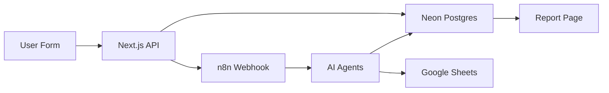

# LBF Technoglow Simulator

AI-powered cosmetic product ideation and formulation platform for Indonesian beauty brands.

## Features

- **AI Formulation Engine**: Intelligent ingredient pairing and stability prediction
- **Workflow Orchestration**: Seamless n8n integration for automated processing
- **Regulatory Intelligence**: Multi-market compliance tracking (BPOM, EU, FDA)
- **Real-time Collaboration**: Google Sheets sync for team workflows
- **Bilingual Support**: Indonesian and English interface

## Tech Stack

- **Framework**: Next.js 14 (App Router)
- **Language**: TypeScript
- **Styling**: Tailwind CSS + Shadcn UI
- **Animation**: Framer Motion
- **Database**: Neon Postgres + Drizzle ORM
- **Workflow**: n8n webhooks
- **Forms**: React Hook Form + Zod
- **Package Manager**: pnpm

## Prerequisites

- Node.js 18+
- pnpm 8+
- Neon Postgres account
- n8n instance (optional for local development)

## Setup

### 1. Clone and Install

```bash
git clone <repository-url>
cd lbf-techno-simulator
pnpm install
```

### 2. Environment Configuration

Copy `.env.example` to `.env` and configure:

```bash
cp .env.example .env
```

Required variables:
- `DATABASE_URL`: Neon Postgres connection string
- `N8N_TEST_WEBHOOK`: n8n test webhook URL
- `N8N_PRODUCTION_WEBHOOK`: n8n production webhook URL

See `docs/environment_setup.md` for detailed configuration.

### 3. Database Setup

Generate and run migrations:

```bash
pnpm db:generate
pnpm db:migrate
```

### 4. Development Server

```bash
pnpm dev
```

Open http://localhost:3000.

## Project Structure

```
/app
  /api
    /submit          -> Submission endpoint
    /result/[id]     -> Report retrieval
    /sync            -> n8n callback handler
  /result/[id]       -> Report viewer page
  /layout.tsx
  /page.tsx          -> Main simulator and landing
/components
  /common            -> Design system (GlassCard, GlowButton, etc.)
  /form              -> Simulator form components
  /report            -> Report display components
  /ui                -> Shadcn UI primitives
/contexts
  /SimulatorContext.tsx
/hooks
  /useWorkflowStatus.ts
  /useFormAutosave.ts
/lib
  /persistence.ts    -> Database operations
  /n8n.ts            -> Webhook dispatcher
  /locations.ts      -> Hierarchical location data
  /payloadBuilder.ts -> JSON schema transformer
  /analytics.ts      -> Audit logging
/db
  /schema.ts         -> Drizzle schema
  /migrations        -> SQL migrations
/tests               -> Jest and React Testing Library tests
```

## Testing

```bash
# Run all tests
pnpm test

# Watch mode
pnpm test:watch

# Type checking
pnpm type-check

# Linting
pnpm lint
```

## Scripts

- `pnpm dev` - Start development server
- `pnpm build` - Production build
- `pnpm start` - Start production server
- `pnpm lint` - Run ESLint
- `pnpm type-check` - TypeScript validation
- `pnpm test` - Run Jest tests
- `pnpm db:generate` - Generate Drizzle migrations
- `pnpm db:migrate` - Apply migrations to database
- `pnpm db:studio` - Open Drizzle Studio
- `pnpm format` - Format code with Prettier

## Workflow Architecture



**Flow:**
1. User submits the form at `/`.
2. Payload is validated and stored in Postgres.
3. An n8n webhook is triggered.
4. n8n orchestrates multi-agent processing for formulation, research, copywriting, and compliance.
5. Results are synced back via `/api/sync`.
6. Google Sheets receives updates for collaboration.
7. The user views the report at `/result/[id]`.

## Database Schema

### Tables

- **submissions**: Core submission records
- **submission_payloads**: Full JSON payloads
- **workflow_runs**: n8n execution tracking
- **report_sections**: Generated report data
- **audit_logs**: Action audit trail

### SQL Preview (for Neon SQL Editor)

```sql
CREATE TABLE submissions (
  id UUID PRIMARY KEY DEFAULT gen_random_uuid(),
  submitted_at TIMESTAMP NOT NULL DEFAULT NOW(),
  target_environment VARCHAR(20) NOT NULL,
  brand_name VARCHAR(255) NOT NULL,
  status VARCHAR(50) NOT NULL DEFAULT 'queued',
  created_at TIMESTAMP NOT NULL DEFAULT NOW(),
  updated_at TIMESTAMP NOT NULL DEFAULT NOW()
);

-- See db/schema.ts for the complete schema
```

## Environment Modes

### Test Mode
- Uses `N8N_TEST_WEBHOOK`
- Sandbox environment
- No production data impact
- Ideal for experimentation

### Production Mode
- Uses `N8N_PRODUCTION_WEBHOOK`
- Full workflow execution
- Google Sheets sync enabled
- Team notifications triggered

## Security

- TLS enforced for all network traffic
- Neon Postgres encryption at rest
- Secrets managed via environment variables
- CORS configured for API routes
- Input validation through Zod schemas

## Documentation

- [Environment Setup](./docs/environment_setup.md)
- [System Architecture](./docs/system_architecture.md)

## Contributing

1. Create a feature branch.
2. Make changes with accompanying tests when possible.
3. Run `pnpm lint` and `pnpm type-check`.
4. Submit a pull request with context.

## License

Proprietary - LBF Technoglow (c) 2024.

## Support

- Email: support@lbftechnoglow.com
- WhatsApp: +62-xxx-xxxx-xxxx
- Hours: Monday to Friday, 9:00-18:00 WIB
