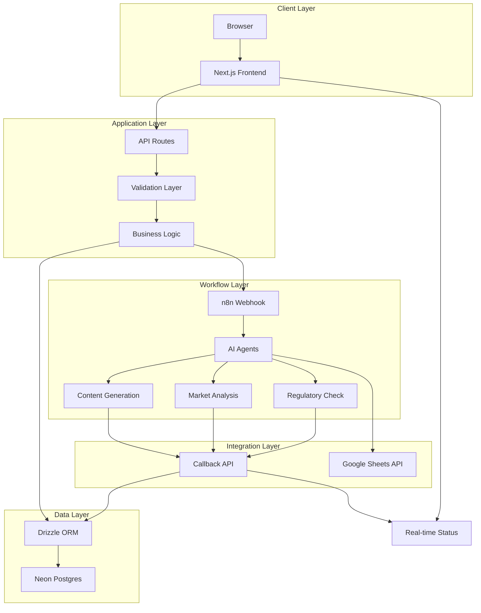
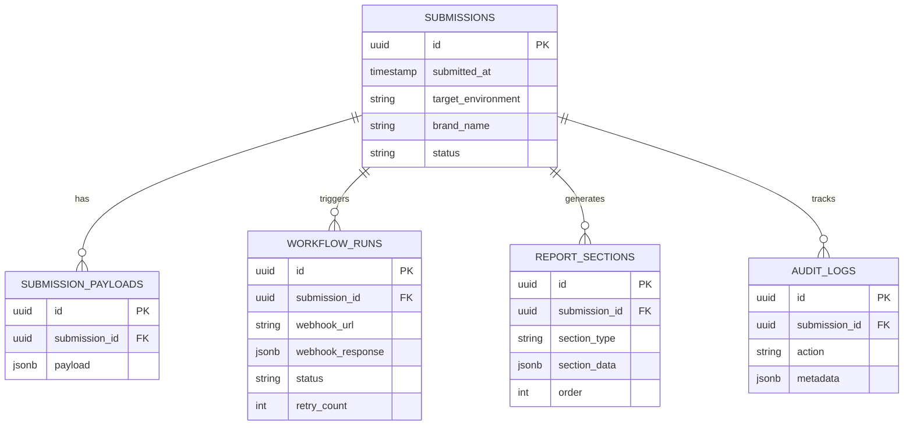

# System Architecture

Technical architecture and design decisions for LBF Technoglow Simulator.

## Overview

LBF Technoglow Simulator is a full-stack Next.js application that orchestrates AI-powered product ideation workflows through n8n, with data persistence in Neon Postgres and team collaboration via Google Sheets.

## Architecture Diagram



## Technology Stack

### Frontend
- **Framework**: Next.js 14 with App Router
- **Language**: TypeScript 5.3
- **Styling**: Tailwind CSS 3.4
- **UI Components**: Shadcn UI (Radix primitives)
- **Animation**: Framer Motion 11
- **Forms**: React Hook Form + Zod validation
- **State**: React Context API

### Backend
- **Runtime**: Node.js 20 (Next.js API Routes)
- **Database**: Neon Postgres (serverless)
- **ORM**: Drizzle ORM 0.30
- **Validation**: Zod 3.22
- **HTTP Client**: Native fetch

### Infrastructure
- **Hosting**: Vercel (recommended)
- **Database**: Neon (managed Postgres)
- **Workflow Engine**: n8n (self-hosted or cloud)
- **Storage**: Google Sheets (via n8n)

### Development
- **Package Manager**: pnpm 8
- **Linting**: ESLint + Prettier
- **Testing**: Jest + React Testing Library
- **Git Hooks**: Husky + lint-staged
- **Type Checking**: TypeScript strict mode

## Data Flow

### 1. Submission Flow

```
User Input -> Form Validation -> Payload Builder -> API Route
    |
    v
Database Insert (submissions, submission_payloads)
    |
    v
Webhook Dispatch (n8n)
    |
    v
Workflow Run Record Created
    |
    v
Response to Client (submissionId)
    |
    v
Redirect to /result/[id]
```

### 2. Processing Flow (n8n)

```
Webhook Received -> Parse Payload -> Validate Schema
    |
    v
Parallel Agent Execution:
    - Formulation Analysis
    - Market Research
    - Copywriting Generation
    - Regulatory Compliance
    - Packaging Design
    |
    v
Aggregate Results
    |
    v
POST to /api/sync (report sections)
    |
    v
Google Sheets Update
```

### 3. Result Retrieval Flow

```
User Visits /result/[id]
    |
    v
Fetch Submission Data
    |
    v
Fetch Report Sections
    |
    v
Poll Workflow Status (if incomplete)
    |
    v
Render Report Components
    |
    v
Export Options (JSON, PDF)
```

## Database Schema

### Entity Relationship



### Indexes

```sql
CREATE INDEX idx_submissions_status ON submissions(status);
CREATE INDEX idx_submissions_created_at ON submissions(created_at DESC);
CREATE INDEX idx_workflow_runs_submission_id ON workflow_runs(submission_id);
CREATE INDEX idx_report_sections_submission_id ON report_sections(submission_id);
CREATE INDEX idx_audit_logs_submission_id ON audit_logs(submission_id);
CREATE INDEX idx_audit_logs_created_at ON audit_logs(created_at DESC);
```

## API Endpoints

### POST /api/submit
**Purpose**: Create new submission and trigger workflow

**Request Body**:
```typescript
SubmissionPayload (see src/types/submission.ts)
```

**Response**:
```json
{
  "submissionId": "uuid",
  "mode": "test" | "production",
  "status": "queued",
  "message": "string"
}
```

**Error Codes**:
- 400: Invalid payload
- 500: Server error

### GET /api/result/[id]
**Purpose**: Retrieve submission and report data

**Query Parameters**:
- `fields=status` (optional): Return only status

**Response**:
```json
{
  "submissionId": "uuid",
  "status": "string",
  "submittedAt": "ISO timestamp",
  "environment": "test" | "production",
  "brandName": "string",
  "payload": { ... },
  "workflow": { ... },
  "sections": { ... }
}
```

### PATCH /api/sync
**Purpose**: Receive callback from n8n with report data

**Request Body**:
```json
{
  "submissionId": "uuid",
  "status": "completed" | "error",
  "reportSections": [
    {
      "type": "productDescription",
      "data": { ... },
      "order": 1
    }
  ]
}
```

**Response**:
```json
{
  "success": true,
  "message": "Submission updated successfully"
}
```

## Component Architecture

### Design System Hierarchy

```
Common Components (Reusable)
- GlassCard
- GlowButton
- NeonBadge
- TimelineStep
- SectionHeader

UI Primitives (Shadcn)
- Button
- Input
- Select
- Switch
- Slider
- ... (20+ components)

Form Components (Domain-specific)
- SimulatorForm
- LocationSelector
- IngredientsInput
- FunctionSelector
- LiveBrief

Report Components (Domain-specific)
- ProductReport
- ProductHeader
- IngredientsTable
- ... (20+ sections)
```

### State Management

**Global State** (Context API):
- Form draft values (localStorage persistence)
- Environment toggle (test/production)
- Submission counter

**Local State** (useState):
- Form field values (React Hook Form)
- Loading states
- Error messages
- Modal visibility

**Server State** (fetch + polling):
- Submission data
- Workflow status
- Report sections

## Security Considerations

### Input Validation
- All form inputs validated with Zod schemas
- SQL injection prevention via Drizzle ORM parameterized queries
- XSS prevention via React's automatic escaping

### Authentication
- Currently no user authentication (planned for v2)
- Webhook signature verification (optional)
- CORS configured for API routes

### Data Protection
- TLS encryption in transit
- Neon Postgres encryption at rest
- Environment variables for secrets
- No sensitive data in client-side code

### Rate Limiting
- Vercel provides automatic DDoS protection
- Consider implementing custom rate limiting for production

## Performance Optimizations

### Frontend
- Code splitting via Next.js dynamic imports
- Image optimization with next/image
- Lazy loading for report sections
- Debounced form autosave
- Memoized expensive computations

### Backend
- Connection pooling (Neon serverless)
- Indexed database queries
- Minimal API response payloads
- Streaming for large reports (future)

### Database
- JSONB for flexible schema
- Partial indexes on filtered queries
- Materialized views for analytics (future)

## Monitoring & Observability

### Logging
- Console logging for development
- Structured logging to external service (optional)
- Audit logs in database

### Metrics
- Submission success rate
- Average processing time
- Database query performance
- Webhook response times

### Error Tracking
- Try-catch blocks in all async operations
- Error boundaries in React components
- Sentry integration (optional)

## Scalability Considerations

### Current Limits
- Neon free tier: 0.5 GB storage, 100 hours compute/month
- n8n: Depends on hosting (5-10 concurrent workflows typical)
- Vercel: 100 GB bandwidth/month (hobby tier)

### Scaling Strategy
1. **Horizontal**: Deploy multiple n8n workers
2. **Vertical**: Upgrade Neon compute tier
3. **Caching**: Add Redis for frequently accessed data
4. **CDN**: Use Vercel Edge Network for static assets
5. **Queue**: Implement job queue for high-volume submissions

## Future Enhancements

### Planned Features
- [ ] User authentication & authorization
- [ ] Multi-tenant support
- [ ] Advanced analytics dashboard
- [ ] PDF export with custom branding
- [ ] Real-time collaboration (WebSockets)
- [ ] Mobile app (React Native)
- [ ] API for third-party integrations

### Technical Debt
- [ ] Comprehensive E2E tests (Playwright)
- [ ] Performance benchmarking
- [ ] Accessibility audit (WCAG 2.1 AA)
- [ ] Internationalization (i18n) beyond bilingual
- [ ] GraphQL API layer (optional)

## Deployment Checklist

- [ ] Environment variables configured
- [ ] Database migrations applied
- [ ] n8n workflows deployed and tested
- [ ] Google Sheets permissions granted
- [ ] Error monitoring enabled
- [ ] Backup strategy confirmed
- [ ] SSL certificates valid
- [ ] DNS records configured
- [ ] Load testing completed
- [ ] Documentation updated

## Support & Maintenance

### Regular Tasks
- **Daily**: Monitor error logs
- **Weekly**: Review submission metrics
- **Monthly**: Database backup verification
- **Quarterly**: Dependency updates
- **Annually**: Security audit

### Incident Response
1. Check Vercel deployment logs
2. Verify Neon database connectivity
3. Inspect n8n workflow execution logs
4. Review recent code changes
5. Rollback if necessary

## References

- [Next.js Documentation](https://nextjs.org/docs)
- [Drizzle ORM](https://orm.drizzle.team)
- [Neon Postgres](https://neon.tech/docs)
- [n8n Documentation](https://docs.n8n.io)
- [Shadcn UI](https://ui.shadcn.com)
